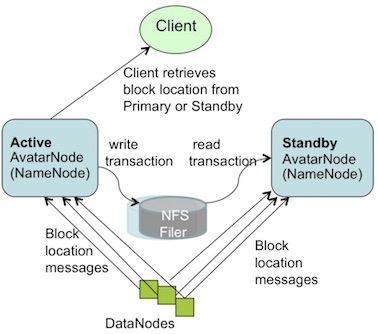

## 来源

* [Apache Hadoop Goes Realtime at Facebook [sigmod 2011]](http://borthakur.com/ftp/RealtimeHadoopSigmod2011.pdf)

## 概要

* 整体
	1. Hadoop生态及相关reference
	2. 应用场景选型过程：使用HDFS/HBase作为Facebook Message的存储
* HDFS
	1. 双Master设计（应用于HDFS的Name Node）
	2. Client支持多版本server APP用于灰度升级
	3. HDFS replica选取策略升级
	4. 加快HDFS的response time

* HBASE
	1. 修复Hbase行级别一致性的相关问题
	2. Region状态信息迁移到zookeeper
	3. 停机时间缩短，逐一重启，解决upgrade期间系统可用性问题
	4. 分布式transaction log分发和重放（split and replay）
	5. 用顺序写设计pipe line，加快data insertion速度
	6. Compaction耗时问题修复（同时有助于提升读速度）
	7. 借助bloom filter及timestamp预判、HDFS local read提升读速度

* 工程实践
	1. 集群测试工具及单机开发环境自动化测试
	2. Region一致性监控，运维监控
	3. 数据特点，spliting storm，以及用手动region split替换自动split的出发点
	4. 预发布环境及2倍强度prodcution work load压测
	5. 可视化dashboard
	6. 在application layer实现跨data center备份
	7. 用预留column的方式支持online schema change
	8. 用开启压缩的map-reduce job实现bulk loading，减少loading增加的网络传输对production work load的冲击
	9. 分析IO bound的原因，降低网络开销

## 论文内容
### Abstract

* FaceBook在部署FaceBook Message时，使用增强版的Hadoop+Hbase来实现数据层。内容如下：

	1. 在consistency、availabilty、partition tolerance、data model、scalabity等需求权衡方面，Hadoop+Hbase方案如何优于Cassandra和Voldemort

	2. 增强版Hadoop如何用于实时系统，配置系统时的tradeoff，如何优于sharded MySQL

	3. 来自于日常工作和未来需求的设计选择

* 为使用Hadoop Based解决方案来替代MySQL的应用提供参考

### 1. Introduction

* Hadoop生态系统及相关的reference

* 传统的解决方案

	Hadoop + Hive：用于离线计算，使用顺序读取，解决throughput和effeciency

	MySQL集群 + Memcached：用于随机读取，满足low latency及相关reference

* 面临的挑战

	需要满足high write throughput，以及cheap elastic storage，

	并同时满足low latency的sequential and random read。

	然而MySQL随机写的throught太低，难以scale up

* 订阅类应用

	增强HDFS以满足需要实时、并发、大数据量的sequential read

* 随机查询类应用

	Facebook Message，PB级数据量，实时随机查询，需借助HBase的scalable和fault tolerant storage以及zookeeper保证的一致性

### 2. Workload Type

Very hight write throught, massive dataset, upredictable growth等负载特点对Sharded RMDB的冲击

#### 2.1 Facebook Messaging

* billion级别数据量(Message Number)，denormalized requirement更使数据翻倍
* 表非常大，即使很少读到的message history，因为对response time的要求，仍然不能使用archive技术来减少表的数据量
* 数据要按照user和message thread排序，以及数据表row number的增加，导致了大负载的随机写
* 聊天数据按照message thread组织，新系统需要支持fast scan，random access，fast bulk import

#### 2.2 Facebook Insights (流量分析系统）

* 实时统计，Fault Tolerant，每秒百万events，以及实时聚合需求，带来了数量庞大的counter

#### 2.3 Facebook Metric System (ODS：Operation Data Store，在线监控)

* 用于监控集群中硬件及软件各种metric指标，需要高write throughput，resharding需求，table scan for analysis的能力
* metric指标数量会突然变化，导致难以auto-resharding（例如某应用长期只收集十几个metric，某次roll-out发布了重大升级，突增了数百个metric）
* 大量读负载集中在近期数据上，但是历史数据必须可用，并随时进行聚合上卷，以支持长时间跨度的统计分析

### 3. Why Hadoop and HBase

* 使用Hadoop-HBase based Solution，为了满足如下需求：

	1. Elasticity：快速扩容，自动load balance并启用新硬件
	2. High write throughput
	3. 单机房内实现强一致性（例如unread message count值要准）：没有在多机房实现主要是因为难度以及单机房内可满足应用需求
	4. 高效的random read on disk：因为Facebook的数据量级和特点，经常miss cache
	5. 高可用及故障恢复，升级或异常时不会停服务，能容忍单机房少量数据缺失并使用其他机房数据弥补
	6. Fault Tolerance：Server故障对用户影响小、甚至没有影响
	7. 用原子Write/Read/Update操作增加并发度
	8. 高效Range Scan

* 没解决的问题

	1. 容忍单机房内部的Network Partition：留给了底层冗余网络硬件来解决
	2. 单机房故障时Zero down-time：做了妥协因为概率小
	3. 地理位置优化：假定用户与数据所在的data center很近、如果不match时cache可以解决

* 基于评估和实验结果，决定使用Hadoop及Hbase作为基础技术，并认为FB团队有能力实现缺失的Feature

	1. HBase：高一致性，高写吞吐
	2. HDFS：name-node有单点失败隐患，但评估认为可以实现一个high available的name node，并且开发代价可接受（in a reasonable time frame）
	3. HBase read efficient：在LSM Tree上增加bloom filter来增加Data Node读效率并缓存Name Node metadata，结果是惊人地达到（striking reach）
	4. HBase与HDFS集群同时失败：导致fault-toleration目标不能达到，用小规模集群缓解这个问题，大范围replication项目可能是解决此类问题的办法
	5. HBase的其他优点：快速随机写、随机读、Streaming读、行级别原子操作、列式存储容易加列、列很多的表、大索引、flexable to scale out

### 4.Realtime HDFS

HDFS原本用于batch system，以scalability及streaming performance见长，容错，大数据量。而现在要做的事情是，让HDFS成为可以支持在线应用(online usage)的低延迟(low latency)的分布式文件系统。

#### (1) High Availability：Avatar Node

##### 问题背景

* Name Node不可用问题：大部分是软件升级停机导致，4年只发生过一次硬件问题导致的故障

* 旧的Name Node冷启动步骤：(1)读fsimage文件载入HDFS上各个block的DataNode (2)读transaction log更新读进来的信息 (3)将最新的信息写入到fsimage文件中 (4)访问DataNodes，通过block report恢复所有的block loction

* 数据量：150 million文件，冷启动总共需要45分钟，其中(1)(2)(3)与(4)花费的时间接近

* 简单Backup Name Node带来的问题是：

	(1) block report所需的20分钟不能节省 

	(2)逐条实时热备份transaction log会降低reliability

##### Name Node热备份

* Avata Name Node是Name Node的Wraper，共两个一主一备：

	主Avata Name Node将fsimage和transaction log写入到NFS。

	备Avata Node从NFS中读取这两个文件，并且追踪transaction log增量，以尽可能与主节点同步，同时还负责定期dump fsimage文件以生成check point。

* 所有Data Node同时与两个Avata Node通信，发送heart beat、block report、block received info

* 两个Avata Node谁主、谁备维护在zookeeper中，Data Node只接受主Avata Node的replication和delete命令

##### Transaction Log升级

* 增加写Transaction Log的实时程度，创建block时立刻写transaction log
* 给log item增加length和checksum，以便备用Avata Node可以识别出写了一半的transaction log （主Avata Node宕机时可能来不及写完一条transaction log）

##### Transparent Failover

* DAFS：Distributed Avata File System

	1. 启动时从zookeeper得到主Avata Name Node的地址
	2. 所有call都direct到主Avata Name Node
	3. 发现请求失败时，DAFS阻塞所有请求，写zookeeper将备用Avata Name Node提升为主Node完成failover，解除block

* DAFS不使用zookeeper subscribe模式，因为subscribe模式耗费更多资源

#### (2) 支持部署在多个Data Center的多版本Hadoop

* 便于部署新版本的hadoop

* 升级Hadoop Client，检测Server版本，并根据不同的版本选用不同的RPC通信协议

#### (3) Block Availability

* 替换默认的随机选取replica策略，根据机架位来选取Block replica节点，根据节点规模来选择replica参数

#### (4) 让HDFS支持Realtime Workload

*	HDFS在多处设计选择上都倾向于增加throughput，而不是response time，需多处升级

##### RPC Timeout

* HDFS原始的做法：遇到Timeout之后发送一个ping，如果能ping通则继续等待

	设计依据：希望在Server临时high load或者stop the world GC时，

	仍然能重试，减少资源消耗，最大限度增加throughput
	
* 新增策略容许在RPC timeout时fast fail，然后找一个新的Data Node进行读写

##### Recovery File Lease

* Write Lease用来确保在单一事件only a single writer working on a file，因此NameNode要维护一个write lease来block其他writer。HDFS原始的做法是：

	Writer（Client）不停地轮询尝试，等待前一个lease被释放，直到写成功

	等待事件长，并且overhead开销大

* 解决办法：增加recoverLease API让Name Node快速更改lease order来为自己授权

##### Read From Local Replicas 

* 升级HDFS Client，检测到有Local Replica时，直接使用Local Replica而不再传输数据给Data Node

#### (5) New Features

##### HDFS sync

* 原本Hflush/Hsync会阻塞写操作，直到Write Pipeline返回response，修改为在等待response期间，容许后续的写操作继续执行

##### Concurrent Readers （while writting)

* 通过按需重新计算last chunk的checksum，来支持读取正在写入中的文件

### 5. Production HBASE

Hbase的优点：

* correctness，durability，availability，performance
* MVCC-like read-write consistency control（RWCC）提供数据隔离级别
* HLog (write ahead log) on HDFS提供数据持久保证

需要做的升级如下：

#### (1) ACID compliance

##### 行级别原子操作保证

* 解决multiple entires of a single row在串行写过程中，region server died导致只写了一半的问题。增加原子保证以后，整行的写操作要么没有发生，要么完整写完。

##### Consistency

* HDFS的replica机制为HBase提供了一致性保证

* 写操作：Pipeline Connection，ACK，Serial Number

* NameNode：发现错误的replication并删除他们

* HLog：forward过程中发现有replica fail时，HBase立刻回滚并重新获取该block

* 预防Data Corruption：读block时检查checksum，发现某个replica错误时，立刻删除，并用另外两个replica来恢复。三个replica都错误时会隔离该block供诊断

#### (2) Availability Improvments

##### Hbase Master Rewrite 

* 问题：在killing test中发现HBase的region数据会丢失，原因是该瞬时状态只存放于Master的内存中，Master被kill时，state也就丢失了

* 解决：花费了较大的力气重写该逻辑，主要的部分是将region assignment信息写到zookeeper中，保证其有效，可以failover

##### Online Upgrade 

大多数停服务是system maintainous导致的，解决的问题如下：

* 问题1：Compaction耗时长，导致Region Server关闭需要数分钟
解决：将Compaction改为可中断，压缩让位于response time，缩短Region Server关闭时间到数秒钟

* 问题2：旧版HBase的Region Servers只能全部同时重启，导致整个集群shutdown
解决：写脚本让Region Servers轮流逐一重启，Master检测到Region失效后会自动重新分配，因此在重启过程中整个集群始终可用

逐一重启引发了HBase不少bug（edge cases），大部分与region server offline and reassignment有关，因此将region server状态存储在Zookeeper上也帮助了这些bug的修复

##### Distributed Log Spitting

Region Server宕机后，发给该Region Sever的HLog需要split并分发到其他Region上重放，以保证这部分数据可用

* 旧版HBase的做法：Master负责split和分发，大量的HLog导致该环节成为瓶颈

* 升级后的做法：Master借助Zookeeper来组织和协调日志的split和重放，时该环节成为一项分布式操作，降低处理时间一个数量级

#### (3) Performance Improvment 

##### Data Insertion

* 借助顺序写来优化，代价是偶尔冗余读，过程如下：

	1. 将Data Transaction写到commit log中
	2. commit log新增数据载入的in-memory cache中
	3. in-memory cache数据量到达阈值时写出到HFile中，HFile是inmutable HDFS File、排序后的key-value pair。随每次flush被dump并添加到perregion list中

* 读操作：并发+聚合的方式读取HFile，汇总成最终结果。HFile周期压缩及合并，以避免degrading读操作

##### Compaction

* Compaction算法的重要性：影响region中文件数量，进而影响到读操作的执行速度，因此花费了较大力气优化

* 问题1：Major Compaction定时执行、会清除冗余数据；Minor压缩根据文件size大小来执行，不清除冗余数据，导致cache低效，后续压缩操作开销大。解决办法是Minor和Major使用相同算法、都清除冗余数据

* 问题2：超过3个HFILE时无条件minor压缩，导致1G文件被压缩了5Million次。解决办法是HFILE数量超过阈值时停止无条件压缩，直到有足够大数量的HFILE时才执行下一次Minor压缩。

* 问题3：调整Older File被合并时的size阈值，旧HBase只在Older HFile体积小于Newer HFile两倍时被合并、算法在文件数量增大时变得抵消；新的HBase在Older HFile体积小于所有Newer HFile聚合后体积两倍时参与合并。新算法在稳定状态下、Older HFile体积大致是Next Newer File的4倍，文件体积曲线变得陡峭、文件数量减少，同时压缩率维持在大约50%左右

##### Read Optimization

* 读优化的两个要点：(1)保持region中文件数量少、减少随机读、如通过前面的Compaction (2)根据query特性跳过特定文件
* 为每个HFile配一个bloomfilter，查询HFile之前用query查询bloomfilter来跳过一些不需要查询的HFile
* HFile增加数据timestamp range的meta data（因为数据大致按timestamp顺序追加），查询时根据Query要查的时间范围过滤，跳过不需要查的HFile
* 把Region放在与数据文件相同的物理节点，借助HDFS的Local Read来加快读取速度

### 6.Deployent and Operational Experience 

介绍Facebook过去数年，从10节点HBase到大量数千节点集群的Deployment and Operation经验，包括：交付高质量软件，正确部署，监控，发现和处理异常，最小化服务不可用时间

#### (1) Testing

* 为了保证开源的HBase以及Facebook自己增加的Feature代码稳定可靠

* 集群测试工具：用随机及特定Query压测，伴随随机kill集群中节点，检查写入的transaction是否都可以正确读出

* 开发验证工具（local development verification）：包含unit tests以及single-server setup，可快速执行完的简单CURD Test，API calls，load test等

#### (2) Monitoring and Tools 

* 监控Region数据的一致性：MetaRegion@HBase，Zookeeper，File@HDFS，InMemoryState@RegionServer，预防edge cases，提供fix功能清理in memory state并让HMaster重新分配这些不一致的region

* 运维监控：重点在Region Server，HBase已经提供的瞬时操作的监控项如写日志、RPC request等；新增了耗时操作的监控如compaction、flushes、log splits；另外监控和跟踪了程序版本的部署节点位置，以便在新版本rolling out过程中监控到特定版本才有的问题

#### (3) Manual v.s Automatic Spliting

* 原版的HBase有自动split的功能，在一个Region变大时，自动split成两个

* 在Facebook的应用场景中，各Region大小都大致相等，一方面split没必要自动，另一方面自动split会导致大量region同时split，引发split storm对production workload造成冲击。

* 实现了手动region，所有region平均分配初始大小，当region均值超过阈值时，用手动可控的方式进行split

* 手动region split也是的region数量稳定，追查region level的日志更加容易；region failover时重放日志也变得容易

* 论文发表时，通过向底层HDFS加机器的方式来扩容，而非在逻辑层面创建更多region，并且表示以后也会考虑能够均匀分配负载的自动split方案

#### (4) Dark Launch

* 产品发布前，复制production环境的work load，以双倍以上强度放在新集群上，有时会运行一周，做发布前的检验。

#### (5) Dashboard / ODS Integration 

JMX + ODS：类似Ganglia的可视化监控工具

* cluster dashboard：average/outlier/min/max, 找到异常的region server，实时统计，根据不同workload（如map-reduce job运行或region split）查看cluster运行状况

* cross-cluster dashboard： overview，latency, get/put count, file per store, compaction queue size, heat map for HMaster/HDFSClient/NameNode/JobTracker versions

#### (6) Backups @ Application Layers

* 用公司内部已经经过类似环境考验日志订阅系统，将Transaciton Log订阅并pipe line到另一个HDFS集群做应用层级的备份。

* 通过重放备份日志的方法，可以应对HBase数据丢失的情况

#### (7) Schema Changes 

* Hbase不支持在线增加column，必须停服务，解决办法是预设一些闲置列。

#### (8) Importing Data 

* 系统接受production work load的同时、Import Data会导致latency增加影响用户体验

* 解决办法时，用Map-Reduce Job实现Bulk Import，Mapper开启Gzip压缩减少网络传输量，Reducer直接生成HFile，加入到HBase中

#### (9) Reduce Network IO

* 发现一些IOBound，通过JMX及日志分析定位和拆解这些IO的来源，将major compaction的间隔从天增加到周，部分列不录入HLog，降低IO量

### 7.Future Work

* 支持secondary indices以及summary view，这些功能通常会遇到数据不一致问题的挑战

* HBase Cache需要发挥超大物理内存的作用，目前的困难在于如何use extrame large heap in Java，在考虑的方法包括:

	写一个slab allactor

	用JNI管理内存
	
	用Flash Memory

* 在双集群备份的基础上，考虑多集群备份及冲突解决机制

## 备注

论文中的部分解决方案，有reference做具体介绍

